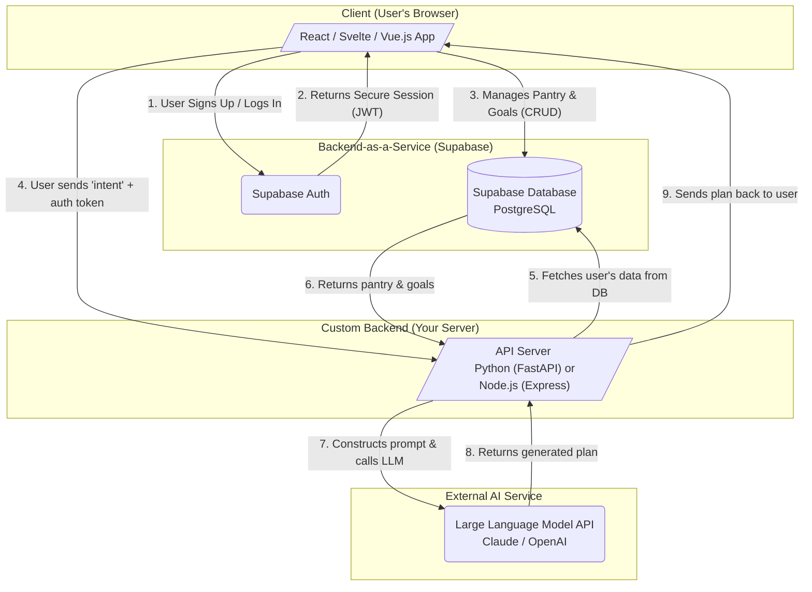

# 🛒 CartIQ

**An AI-powered household assistant that creates dynamic shopping plans based on your real-time context, not just your shopping history.**

[**Live Demo**](#) <!-- Add your Vercel/Netlify deployment link here -->


---

## 🧠 Core Concept

Existing shopping and meal-planning apps are typically task-based (e.g., “find a recipe,” “add to a list”).  
This places the **cognitive load of planning** and connecting tasks onto the user.

**CartIQ** is a “household-first” proof-of-concept that shifts this paradigm — it leverages a **Large Language Model (LLM)** to act as a **central household planner**.  

The system translates natural language intents like:  
> “I need a cheap, quick plan for the week using the items I already have.”  

into **structured, actionable outputs** using a stateful approach that combines the user’s **persistent data** (pantry, goals) with their **immediate intent**.

---

## 🏗️ Architecture Diagram



---

## 🧩 Technology Stack

| **Category** | **Technology** | **Purpose** |
|---------------|----------------|--------------|
| **Frontend** | React (or Svelte/Vue.js) | Building the user interface. |
| **Database & Auth** | Supabase | Backend-as-a-Service Platform. |
| &nbsp;&nbsp;&nbsp;&nbsp;→ Database | PostgreSQL | Storing all user and household data (pantry, goals). |
| &nbsp;&nbsp;&nbsp;&nbsp;→ Auth | Supabase Auth | Secure user authentication and session management (JWT). |
| **Custom Backend** | Python (FastAPI) or Node.js (Express) | A minimal API server to handle the core AI logic securely. |
| **AI / LLM** | Anthropic (Claude API) or OpenAI API | The generative “brain” for planning and list creation. |

---

## ✅ Features

### **MVP Scope (Implemented)**

This project focuses on delivering the **core AI planning loop** in a secure, full-stack environment.

#### 🔐 Secure User Authentication
- Full signup, login, and session management via Supabase Auth.

#### 🏡 Persistent Household Profile
- **Virtual Pantry:** CRUD operations (Create, Read, Update, Delete) for user inventory stored in PostgreSQL.  
- **Goals & Constraints:** Save and update household rules like dietary needs and budget.

#### 🤖 AI-Powered Planner
- A chat interface for natural language input.
- The backend securely fetches the user’s pantry and goals.
- Constructs detailed prompts for the LLM to generate **contextually-aware meal plans** and **shopping lists**.

---

## 🚀 Future Scope (Roadmap)

These features were intentionally scoped out of the MVP to ensure rapid development but represent the full vision for the application.

### 📸 Automated Pantry Input (Computer Vision / OCR)
- Implement camera-based scanning to recognize pantry items.
- Add purchased items automatically through receipt scanning.

### 🏬 Real-Time Store Integration (RAG)
- Integrate with store APIs to fetch real-time product availability and pricing.
- Build an “in-store co-pilot” to suggest intelligent replacements for out-of-stock items.

### ⏰ Proactive Lifecycle Management
- Track item expiration and send proactive push notifications.
- Provide analytics and feedback on household goals like **budget adherence** and **food waste reduction**.

---

## ⚙️ Setup and Installation

You can add your setup instructions here:

```bash
# Clone the repo
git clone https://github.com/yourusername/CartIQ.git
cd CartIQ

# Install frontend dependencies
cd frontend
npm install

# Set up your environment variables
cp .env.example .env

# Start the development server
npm run dev
